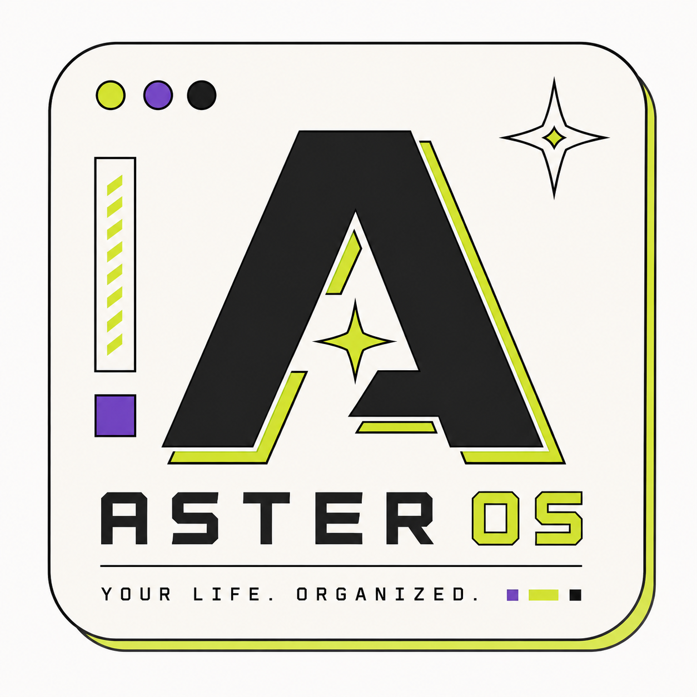
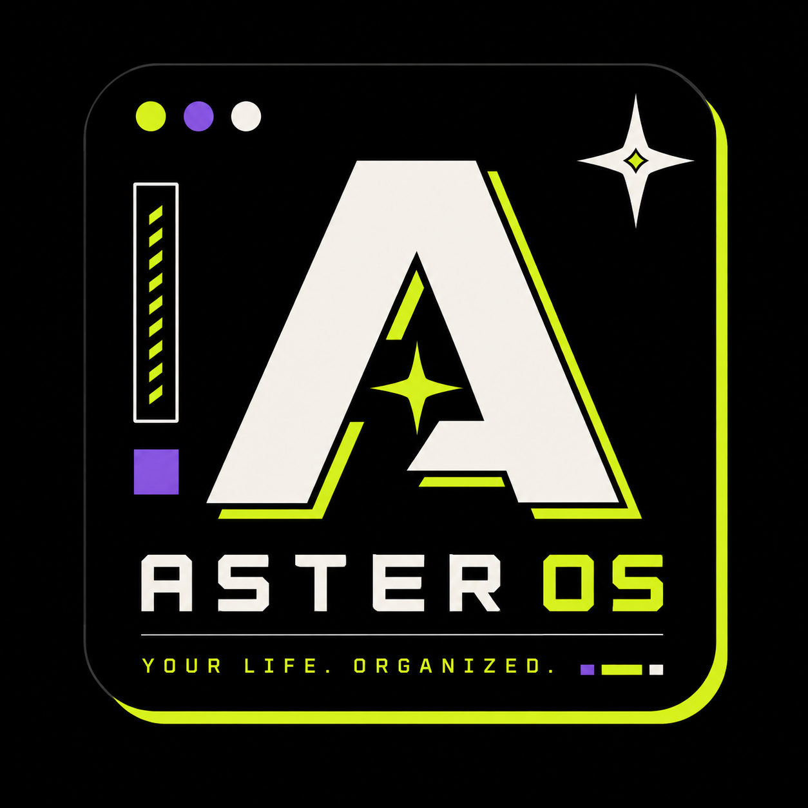

<div align="center">

  <picture>
    <source media="(prefers-color-scheme: dark)" srcset="logo-dark.png">
    <source media="(prefers-color-scheme: light)" srcset="logo-light.png">
    
  </picture>

  <br />
  <br />

  # ⚡ ASTER OS — Personal Life Operating System

  [](https://aster-os.netlify.app/)
  [](./LICENSE)
  [](https://www.linkedin.com/in/sameer-beniwal)
  
  
  
  
  

  <br />

  ### 🚀 **[Try the Live Web App Here](https://aster-os.netlify.app/)**

  **A high-performance, privacy-first, Neo-Brutalist personal command center for tracking tasks, daily journal & sleep cycles, workout logs, IMDb movie library, wardrobe outfits, milestone goals, expenses, and coding challenges.**

</div>

---

## 🎨 Branding & Theme Logos

Aster OS includes custom high-resolution logos tailored for both dark and light UI themes:

| Theme | Preview | File Location |
| :--- | :---: | :--- |
| **Dark Mode Logo** |  | `logo-dark.png` |
| **Light Mode Logo** |  | `logo-light.png` |

---

## 👨‍💻 Created & Maintained By

**Sameer Beniwal**  
*Lead System Architect & Full-Stack Developer*  
🔗 **LinkedIn**: [linkedin.com/in/sameer-beniwal](https://www.linkedin.com/in/sameer-beniwal)  
🌐 **Live Platform**: [aster-os.netlify.app](https://aster-os.netlify.app/)  

---

## 🌟 Key Features

### ⚡ 1. Command Center (Dashboard)
- **Live Clock & Time-based Greeting**: Dynamic greetings (*"Good Evening 👋"*) paired with a live ticking clock.
- **Sleep Last Night**: Directly synced from your daily journal sleep logs.
- **Current Streaks**: Visual streak tracking for Journal entries, Gym workouts, and Tasks completed.
- **Top 3 Priorities & Classes**: Instant view of urgent tasks due today and college schedule.
- **Interactive Mood Selector**: Log your mood directly from the dashboard with 1-click emoji buttons.
- **Quick Notes & Quote Generator**: Persistent quick scratchpad + inspirational quote generator.

### 🎬 2. Movies & TV Shows Module
- **IMDb Auto-Fetching**: Enter any movie title and click **`⚡ SEARCH IMDB`** to automatically fetch high-res posters, official IMDb ratings (`⭐ 8.8 IMDb`), release year, genre tags, director, and plot overview.
- **Closest Search Candidate Suggestions**: Automatic fuzzy search candidate cards to easily find the exact movie even with typos or punctuation differences.
- **Watchlist & Watched Filters**: Organize movies into Watchlist or Watched tabs with interactive 5-star user rating capability.

### 👔 3. Wardrobe Studio & Outfit Builder
- **Clothing Item Tracker**: Categorize clothes by type (*Tops, Bottoms, Shoes, Outerwear, Accessories*) and Season (*Spring, Summer, Fall, Winter, All Seasons*).
- **Outfit Combination Studio**: Mix and match tops, bottoms, shoes, and outerwear into complete named outfit combinations for any occasion.
- **Wear Count Tracker**: Click `+1 WEAR` or `WEAR TODAY` to automatically track usage and calculate your **Most Worn** items.

### 🎯 4. Milestone Goals Hub
- **Custom Categories**: Create, manage, and assign custom categories (*Health & Fitness, Career, Finance, Side Projects, Short Term, Long Term*).
- **Sub-Milestones Checklist**: Add granular sub-tasks. Checking off sub-tasks dynamically updates the goal progress bar (0–100%) and auto-completes goals.

### 💻 5. Coding Hub & Problem Logs
- **Challenge & Commit Logger**: Log LeetCode problems, GitHub project pushes, HackerRank challenges, and Codeforces matches.
- **Metrics & Filters**: Stat cards for Easy/Medium/Hard problems solved and category filter buttons.

### 📓 6. Daily Journal & Sleep Cycle Tracker
- **Immediate Editor Load**: Today's entry is automatically loaded on page view.
- **Sleep Cycle Tracker**: Bedtime, Wake time, calculated Sleep Duration (hrs), and Sleep Quality selection.
- **Water Intake Tracker**: Visual glass counter (`0 / 8 glasses`) with 1-tap quick buttons.
- **Energy & Productivity Scale**: 1–5 scale selector for Energy and Productivity levels.
- **Habits Checklist & Gratitude**: Daily checkboxes for meditation, exercise, reading, and gratitude reflection.
- **Past Date Logging**: Log or edit entries for any historical calendar date.

### ⚙️ 7. Dynamic Theme Engine & Settings
- **7 Preset Neo-Brutalist Themes**: Paper Soft, Cyber Dark, Cobalt Blue, Cyber Amber, Electric Violet, Emerald Mint, Crimson Red.
- **Custom Accent Color Picker**: Native color picker (`<input type="color">`) to dynamically customize CSS variables across the app.
- **Data Management**: Export/Import complete workspace backups as `.json` or export tasks as `.csv`.

### 📊 8. System Analytics
- **Productivity Score**: Dynamic 0–100 score calculated from tasks, gym workouts, coding logs, journal streaks, and goals.
- **Visual Neo-Brutalist Charts**: Bar & line charts tracking sleep trends, gym frequency, spending trends, and coding activity.

---

## 🛠 Tech Stack

- **Frontend Core**: React 19, Vite 8, React Router DOM v7
- **State Management**: Zustand 5 (with Firestore + LocalStorage sync)
- **Database & Authentication**: Firebase v12 (Firestore & Google Auth)
- **Styling**: Vanilla CSS (Custom Neo-Brutalist Design System with CSS Variables)

---

## 🚀 Local Development Setup

### 1. Prerequisites
- **Node.js**: v18.0.0 or higher
- **npm**: v9.0.0 or higher

### 2. Installation
```bash
# Clone the repository
git clone https://github.com/sameer-776/aster-os.git

# Navigate into project directory
cd aster-os

# Install dependencies
npm install
```

### 3. Running Locally
```bash
# Start the local development server
npm run dev
```
Open your browser and navigate to `http://localhost:5173`.

### 4. Production Build
```bash
# Build the application for production
npm run build

# Preview production build
npm run preview
```

---

## ⌨️ Keyboard Shortcuts

| Shortcut | Action |
| --- | --- |
| `Ctrl + K` | Global Search bar focus |
| `Ctrl + N` | Quick Add Task |
| `Esc` | Close Modal / Cancel Search |

---

## 📄 License & Copyright

Copyright © 2026 **Sameer Beniwal**. All Rights Reserved.

This application and its source code are **Proprietary & Confidential**. Unauthorized copying, modification, redistribution, or commercial use without prior written consent from Sameer Beniwal is strictly prohibited. See the [LICENSE](./LICENSE) file for complete details.

Built with ❤️ by **Sameer Beniwal**.
